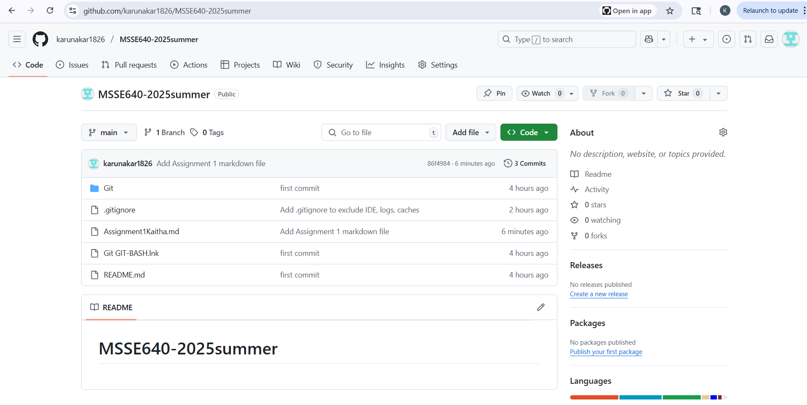

 Assignment 1  Karunakar Reddy Kaitha


 Overview

For this assignment, I explored Git, GitHub, and the general workflow of using a distributed version control system (DVCS).  
I set up a local repository on my machine, connected it to a remote repository on GitHub, and practiced pushing commits.  

This was a great opportunity to build hands-on skills in tools that every modern software engineer uses.


 What I Researched and Learned

 Types of Version Control Systems

While doing my research, I found there are mainly two types of version control systems:

 Centralized Version Control Systems (CVCS) like SVN or CVS, which have a single central server containing the versioned files. Everyone checks in and out from this single place.  
  ➡ The drawback: if the server goes down, nobody can collaborate.

 Distributed Version Control Systems (DVCS) like Git, where every developer has a complete copy of the repository including full history on their own machine.  
  ➡ This makes collaboration faster, safer, and more flexible.

Git is a DVCS, which means I have a full backup locally, and can still work even without a network connection.


 Key Git Concepts I Learned

 Repository:  
   A Git repository (`repo`) is the database where Git stores all the snapshots (commits) and metadata.  
   A local repo is on my machine; a remote repo is hosted on GitHub.

 Working Directory:  
   This is where I actually modify my project files.

 Staging Area (Index):  
   A middle step before committing.  
   When I use `git add`, I move changes into the staging area. This lets me control exactly what goes into the next commit.

 Commits:  
   Think of commits like checkpoints or save points.  
   Each commit has a unique SHA1 hash.  
   They allow me to roll back or review history.

 Snapshots vs Diffs:  
   Unlike older systems that track differences line by line, Git stores a snapshot of the entire project at each commit.  
   If files didn’t change, Git links to the old file, saving space.


 Useful Diagram


This diagram (captured from my terminal) helped me visualize how files move:

 From the Working Directory (where I edit)  
 to the Staging Area (using `git add`),  
 then to a commit in the local repository (using `git commit`),  
 and finally pushed to the remote repository on GitHub (using `git push`).

This gave me a clear sense of how Git manages project history.


 What I Did

 Installed Git Bash on Windows and VS Code as my editor.
 Created a new GitHub account and set up my remote repository for the class.
 Initialized a local repo with `git-init`, set my local config name and email, and created a README.
 Connected my local repo to the GitHub remote using:
    ```bash
    git remote add origin https://github.com/karunakar1826/MSSE6402025summer.git
    ```
 Created commits with:
    ```bash
    git add .
    git commit m "initial commit"
    ```
 Then pushed to GitHub with:
    ```bash
    git push u origin main
    ```


 My Screenshots

 Git Workflow on My Machine


This shows my terminal after running `git status`, where everything is committed and clean.  
This proved to me that my local repo was in sync, and no files were left staged or untracked.


 GitHub Repository Confirmation



This is a screenshot of my GitHub repository page.  
It shows all the commits have been successfully pushed.  
I can see my README, my assignment markdown file, and the history.  
This confirms everything is version controlled and stored safely on GitHub.


 Reflections & Takeaways

Doing this step-by-step helped me really understand Git’s core ideas.  
Before, I mostly copied commands from tutorials without really knowing what was happening under the hood.

Now I have a much better mental model:

 The working directory is where I make changes.
 The staging area is a place to prepare what will be saved.
 Commits create snapshots in my local repo history.
 The remote repo on GitHub is like an online backup and collaboration hub.

I also realized why commits with good messages matter — they’re not just for me today, but for my future self (or teammates) trying to understand how the project evolved.


 Link to My Repository

 GitHub Repo: [MSSE6402025summer](https://github.com/karunakar1826/MSSE6402025summer)


